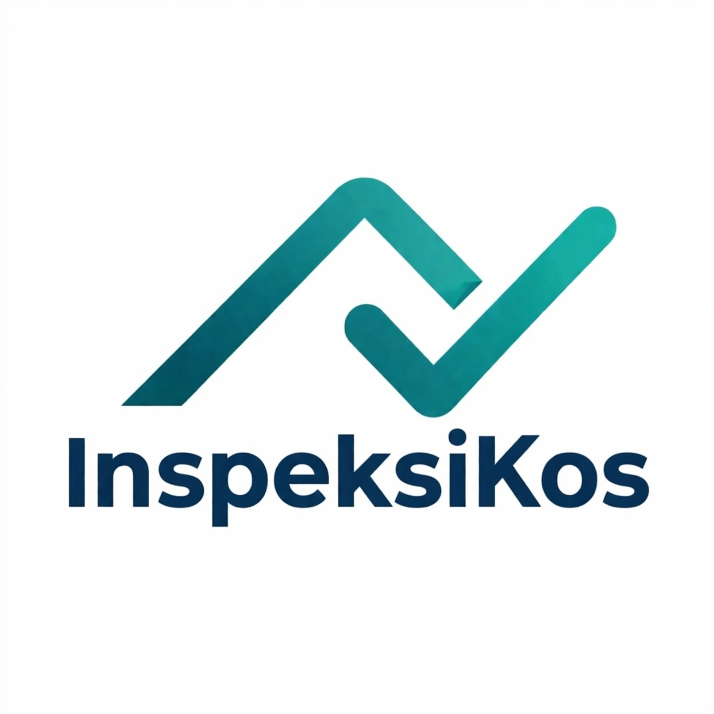
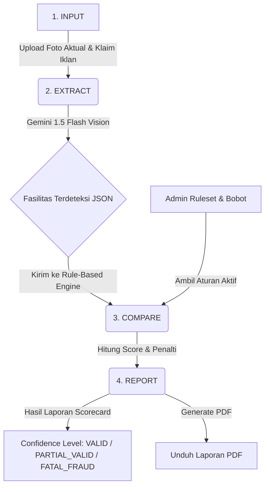

# 🏠 InspeksiKos

<p align="center">
  
</p>

<p align="center">
  <strong>Platform Automated Fact-Checking Fasilitas Kos Berbasis Cloud & AI</strong>
</p>

<p align="center">
  <a href="https://nextjs.org/"></a>
  <a href="https://nestjs.com/"></a>
  <a href="https://ai.google.dev/"></a>
  <a href="https://www.typescriptlang.org/"></a>
  <a href="https://www.postgresql.org/"></a>
  <a href="https://vercel.com/"></a>
  <a href="https://cloud.google.com/run"></a>
</p>

**InspeksiKos** adalah platform *automated fact-checking* (SaaS) berbasis Cloud untuk memvalidasi spesifikasi fasilitas kamar kos secara real-time. Platform ini dirancang untuk memecahkan masalah **catfishing iklan kos** di Kota Padang dengan membandingkan klaim iklan terhadap data lapangan aktual menggunakan kecerdasan buatan **Gemini AI Vision** dan **Rule-Based Engine**.


## ⚙️ Alur Kerja Sistem (Pipeline)

Sistem memvalidasi properti melalui 3 langkah otomatis:



---

## 🚀 Fitur Utama

### 🎓 Bagi Mahasiswa (Pencari Kos)
* **Pengajuan Inspeksi**: Menginput nama, alamat, serta klaim fasilitas kos (seperti AC, WiFi, Kamar Mandi Dalam).
* **Monitoring Real-Time**: Memantau status inspeksi dari `Pending` -> `In Progress` -> `Completed`.
* **Unduh Scorecard PDF**: Mendapatkan laporan audit resmi beserta status validitas (`VALID`, `PARTIAL_VALID`, `FATAL_FRAUD`).

### 🕵️‍♂️ Bagi Inspektur (Verifikator Lapangan)
* **Manajemen Tugas**: Menerima daftar kos yang ditugaskan oleh admin untuk diinspeksi.
* **Input Data Teknis**: Mengunggah foto aktual setiap tipe ruangan, mengukur kualitas air (TDS meter), dan menguji kecepatan internet (Speedtest).
* **Ekstraksi AI**: Foto yang diunggah diproses langsung oleh Gemini AI Vision untuk mengekstrak fasilitas yang tertangkap kamera.

### 👑 Bagi Administrator
* **Manajemen Aturan Audit (Audit Rules)**: Menentukan bobot nilai (`weight`) dan penalti (`penalty`) untuk setiap fasilitas.
* **Sistem Fleksibel**: Dapat mengubah threshold parameter teknis (misal: syarat air bersih TDS < 300 mg/L) secara dinamis tanpa mengubah kode.

---

## 🛠️ Tech Stack

| Layer | Teknologi | Deskripsi / Fungsi | Hosting |
|---|---|---|---|
| **Frontend** | Next.js 14 (App Router) | Framework UI & Routing Client | Vercel |
| **Backend** | NestJS (TypeScript) | API Gateway, Services, Controllers | Google Cloud Run |
| **Database** | PostgreSQL (Neon DB) | Serverless relational database | Neon |
| **Storage** | Supabase Storage | Penyimpanan foto properti & dokumen PDF | Supabase Cloud |
| **AI Integration** | Gemini 1.5 Flash API | Ekstraksi fitur visual pada foto aktual | Google AI Studio |
| **ORM** | TypeORM | Pemetaan database & relasi entitas | — |
| **CI/CD** | GitHub Actions | Automated build, test, & deployment | Self-Hosted Runner |

---

## 📂 Struktur Repositori

```text
inspeksikos/
├── frontend/                       # Next.js Application (Vercel)
│   ├── app/                        # App Router (Pages & Layouts)
│   │   ├── (auth)/                 # Login & Register
│   │   ├── (mahasiswa)/            # Dashboard, Upload Request, Riwayat & Laporan
│   │   ├── (inspektur)/            # Dashboard Inspektur & Form Inspeksi Lapangan
│   │   └── (admin)/                # Panel Kelola Rule & Bobot Audit
│   ├── components/                 # Reusable UI Components
│   └── lib/                        # Axios instance & JWT Interceptors
├── backend/                        # NestJS Application (Google Cloud Run)
│   ├── src/
│   │   ├── auth/                   # Autentikasi JWT (Access + Refresh Token)
│   │   ├── properties/             # Manajemen properti kos
│   │   ├── inspections/            # Manajemen sesi inspeksi lapangan
│   │   ├── audit/                  # Logika komparasi & Rule-Based Engine
│   │   ├── gemini/                 # Integrasi dengan Gemini AI Vision API
│   │   └── pdf/                    # Pembuatan file PDF Laporan
└── .github/workflows/              # Konfigurasi Deployment CI/CD (GitHub Actions)
```

---

## 💻 Panduan Instalasi Lokal

### Prasyarat
* Node.js >= 20
* npm >= 10
* Database PostgreSQL (direkomendasikan menggunakan Neon DB Cloud)
* Gemini API Key dari [Google AI Studio](https://aistudio.google.com/)

### 1. Clone Repositori & Install Dependensi
```bash
# Clone repository
git clone https://github.com/awanbadut/InspeksiKos-dev.git
cd InspeksiKos-dev

# Install dependencies backend
cd backend && npm install

# Install dependencies frontend
cd ../frontend && npm install
```

### 2. Setup Environment Variables
Salin file `.env.example` menjadi `.env` di masing-masing folder `backend` dan `frontend`:

#### Untuk Backend (`backend/.env`)
```env
PORT=3001
DATABASE_URL=postgresql://<user>:<password>@<host>/<database>?sslmode=require
JWT_SECRET=your_jwt_secret_key
GEMINI_API_KEY=your_gemini_api_key

# Supabase Storage Configuration
SUPABASE_URL=https://<project-id>.supabase.co
SUPABASE_ANON_KEY=your_supabase_anon_key
SUPABASE_BUCKET=inspeksikos-photos
```

#### Untuk Frontend (`frontend/.env`)
```env
NEXT_PUBLIC_API_URL=http://localhost:3001
NEXT_PUBLIC_APP_NAME=InspeksiKos
```

### 3. Migrasi & Seeding Database
Jalankan perintah ini di direktori `backend` untuk mempersiapkan skema database dan data aturan awal:
```bash
cd backend

# Jalankan migrasi database
npm run migration:run

# Jalankan seeder ruleset default
npm run seed:audit-rules
```

### 4. Jalankan Aplikasi
Jalankan dev server untuk backend dan frontend secara bersamaan:

```bash
# Di terminal 1 (Jalankan backend di port 3001)
cd backend && npm run start:dev

# Di terminal 2 (Jalankan frontend di port 3000)
cd frontend && npm run dev
```
Buka [http://localhost:3000](http://localhost:3000) pada browser Anda.

---

## 🧪 Pipeline CI/CD

Platform ini memiliki alur integrasi dan pengantaran berkelanjutan (CI/CD) yang diotomatisasi menggunakan **GitHub Actions**:
* **Frontend Workflow**: Melakukan build Next.js dan mendeploy ke **Vercel** setiap kali ada push di direktori `frontend/**`.
* **Backend Workflow**: Membangun Docker Image dan mendeploy ke **Google Cloud Run** setiap kali ada push di direktori `backend/**`.

Kedua alur kerja tersebut dijalankan pada infrastruktur lokal melalui *Self-Hosted Runner* guna menjamin efisiensi resource build.

---

## 🎓 Kontributor

* **Zikry Kurniawan** - NIM 2311081042 - TRPL 3A - Politeknik Negeri Padang (2026)
